# Advent of Code 2023

Language: Golang

This makes use of a template provided by https://github.com/nlowe for generating the CLI commands and inputs for each day.

## Building

This project was created with 1.21.

```
cd 2023
go mod download
go test ./...
go build
```

## Running solutions

After building, the code can be run by typing the question name and part (a or b).

```
# Run Question 21 part 1
2023 21a

# Run all questions in sequence
2023 all
```

## Progress

| .      | [1](https://adventofcode.com/2023/day/1) | [2](https://adventofcode.com/2023/day/2) | [3](https://adventofcode.com/2023/day/3) | [4](https://adventofcode.com/2023/day/4) | [5](https://adventofcode.com/2023/day/5) | [6](https://adventofcode.com/2023/day/6) | [7](https://adventofcode.com/2023/day/7) | [8](https://adventofcode.com/2023/day/8) | [9](https://adventofcode.com/2023/day/9) | [10](https://adventofcode.com/2023/day/10) | [11](https://adventofcode.com/2023/day/11) | [12](https://adventofcode.com/2023/day/12) | [13](https://adventofcode.com/2023/day/13) | [14](https://adventofcode.com/2023/day/14) | [15](https://adventofcode.com/2023/day/15) | [16](https://adventofcode.com/2023/day/16) | [17](https://adventofcode.com/2023/day/17) | [18](https://adventofcode.com/2023/day/18) | [19](https://adventofcode.com/2023/day/19) | [20](https://adventofcode.com/2023/day/20) | [21](https://adventofcode.com/2023/day/21) | [22](https://adventofcode.com/2023/day/22) | [23](https://adventofcode.com/2023/day/23) | [24](https://adventofcode.com/2023/day/24) | [25](https://adventofcode.com/2023/day/25) |
| ------ | ---------------------------------------- | ---------------------------------------- | ---------------------------------------- | ---------------------------------------- | ---------------------------------------- | ---------------------------------------- | ---------------------------------------- | ---------------------------------------- | ---------------------------------------- | ------------------------------------------ | ------------------------------------------ | ------------------------------------------ | ------------------------------------------ | ------------------------------------------ | ------------------------------------------ | ------------------------------------------ | ------------------------------------------ | ------------------------------------------ | ------------------------------------------ | ------------------------------------------ | ------------------------------------------ | ------------------------------------------ | ------------------------------------------ | ------------------------------------------ | ------------------------------------------ |
| Part 1 | ✔️                                       | ✔️                                       | ✔️                                       | ✔️                                       | ✔️                                       | ✔️                                       | ✔️                                       | ✔️                                       | ✔️                                       | ✔️                                         | ✔️                                         | ✔️                                         | ✔️                                         | ✔️                                         | ✔️                                         | ✔️                                         | ✔️                                         | ✔️                                         | ✔️                                         | ✔️                                         | ✔️                                         | ✔️                                         | ✔️                                         | ✔️                                         | ✔️                                         |
| Part 2 | ✔️                                       | ✔️                                       | ✔️                                       | ✔️                                       | ✔️                                       | ✔️                                       | ✔️                                       | ✔️                                       | ✔️                                       | ✔️                                         | ✔️                                         | ✔️                                         | ✔️                                         | ✔️                                         | ✔️                                         | ✔️                                         | ✔️                                         | ✔️                                         | ✔️                                         | ✔️                                         | ✔️                                         | ✔️                                         | ✔️                                         | ✔️                                         | ✔️                                         |

## Visualisations

Day 10: Constructing a closed path


Day 16: Following a set of branching lines (aka squiggles!)

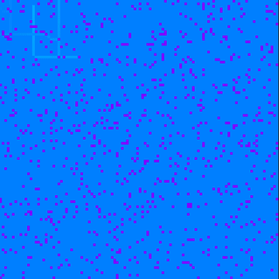

Day 18: Constructing a closed path, again

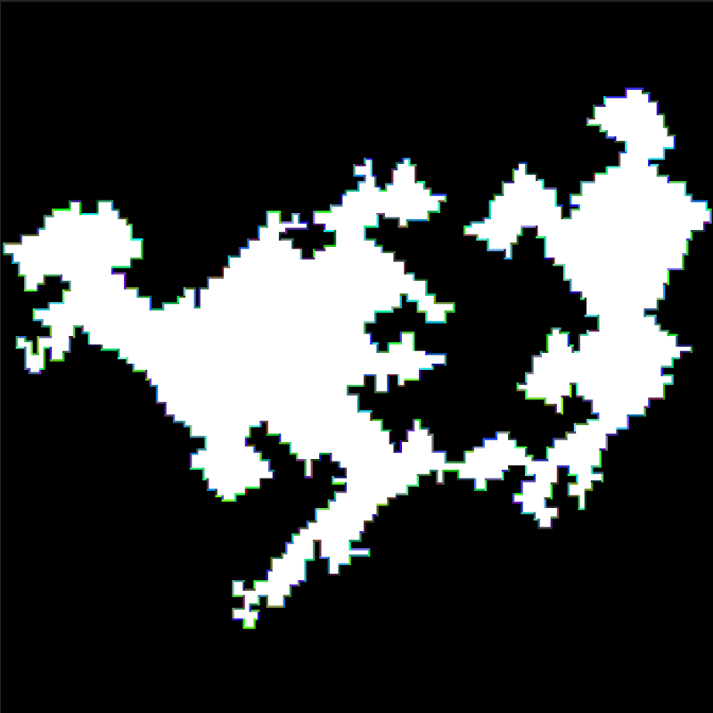

## Comments

### Day 2

This was the day I decided to teach myself enough regex to carry me through the rest of the season. Regexes are almost fun now.

### Day 5

Day 5 part 2 was the first question that took me a lot of time to find a solution I was happy with. I was able to brute force it in about 4 minutes when I first completed it, and then I rewrote it using interval programming. I'm sure there are a lot more efficient versions of the functions I wrote but I'm happy with this as my first exposure to the area.

### Day 8

The way the input of this problem is specifically set up to be much easier than one would expect if they were given an unknown input annoyed me a lot (a recurring theme for this year). Not content to settle for "just do LCM on the cycle lengths and it works just because", I added logic to properly check for cycles which encounter the "final" value at any point within the cycle (or multiple times).

### Day 9

Who needs difference methods for getting lists of numbers when you can use Lagrange polynomials instead :)

### Day 10

I'm not sure of how often I'll get use out of the even-odd method for determining if a point is contained in a contour but it I think it's pretty cool, and I was able to reuse it on day 18.

### Day 12

Dynamic Programming! The thing I've been avoiding forever. It's still pretty scary to me but I was able to come up with a general method for this question eventually.

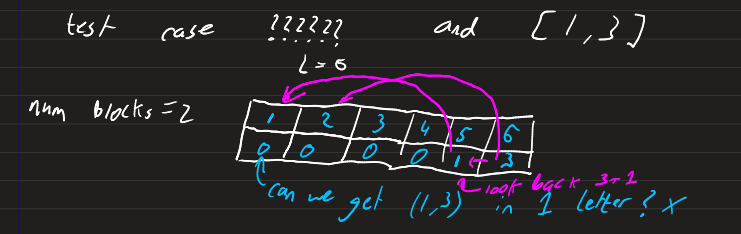

### Day 17

Dijkstra, but you're able to jump between 1 and 3 nodes at once. This one was really tough to get my head around, but hopefully I can look back on this answer if anything like it is needed in the future.

### Day 20

Another question which relies on inspecting the input and realising the solution is to reverse engineer the machine to realise that it emulates a system with 4 12-bit registers that requires you to find the lowest common multiple of the values encoded in them. It really annoyed me that there was no indication that the input was special, and the alternative (to try and brute force a 48-bit state machine into a certain configuration) almost scared me away from this question.

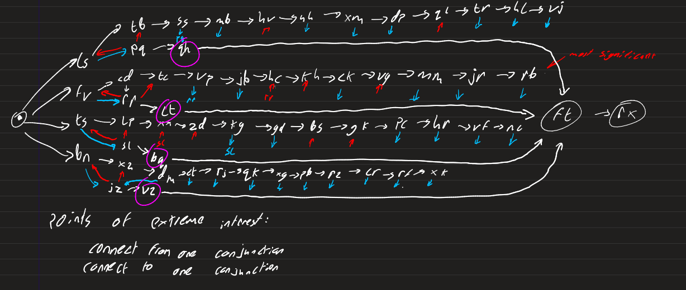

### Day 21

Another case of "find the hidden property of the input that reduces this to some maths, and then do some maths". I documented some of my thought process as I progressed through this question in the comments in [part 2](2023/core/day21/b.go), though all the assumptions I made in this question relied on me accidentally finding out the row 66 and column 66 of this question's input are empty.

### Day 23

My slowest question (part 2) runs in 6 seconds. The longest path problem is interesting but I don't see any obvious ways of optimising it except for maybe adding some caching.

### Day 24

This one went really, really heavy on the linear algebra, which I wasn't expecting. I had to import a package for this because I don't see any way of solving this without symbolic programming. On the plus side, I guess I know symbolic programming now, so no system of equations can ever stop me.

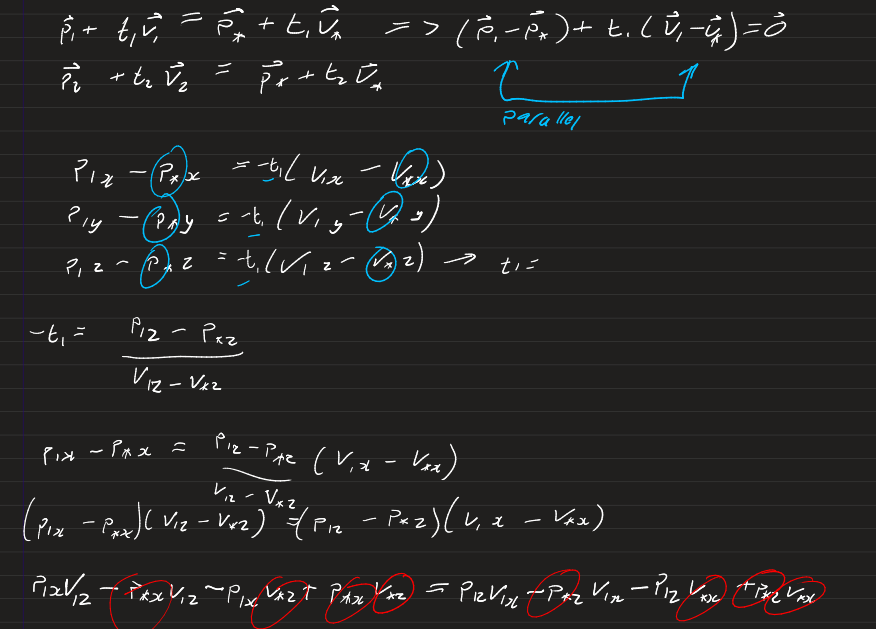

### Day 25

Day25s are usually easy but today was definitely an exception. Finding the right package to import was a huge pain but after that it was alright. This is the second day in a row where there would have been a very well known python package to import, but to complete it in Go I had to do a fair amount of searching, implementing, running into bugs, attempts at bug fixing before resigning and finding a new package, and reimplementing.

## Advent of Code 2022

Language: Python (Jupyter Notebook)

## Progress

| .      | [1](https://adventofcode.com/2022/day/1) | [2](https://adventofcode.com/2022/day/2) | [3](https://adventofcode.com/2022/day/3) | [4](https://adventofcode.com/2022/day/4) | [5](https://adventofcode.com/2022/day/5) | [6](https://adventofcode.com/2022/day/6) | [7](https://adventofcode.com/2022/day/7) | [8](https://adventofcode.com/2022/day/8) | [9](https://adventofcode.com/2022/day/9) | [10](https://adventofcode.com/2022/day/10) | [11](https://adventofcode.com/2022/day/11) | [12](https://adventofcode.com/2022/day/12) | [13](https://adventofcode.com/2022/day/13) | [14](https://adventofcode.com/2022/day/14) | [15](https://adventofcode.com/2022/day/15) | [16](https://adventofcode.com/2022/day/16) | [17](https://adventofcode.com/2022/day/17) | [18](https://adventofcode.com/2022/day/18) | [19](https://adventofcode.com/2022/day/19) | [20](https://adventofcode.com/2022/day/20) | [21](https://adventofcode.com/2022/day/21) | [22](https://adventofcode.com/2022/day/22) | [23](https://adventofcode.com/2022/day/23) | [24](https://adventofcode.com/2022/day/24) | [25](https://adventofcode.com/2022/day/25) |
| ------ | ---------------------------------------- | ---------------------------------------- | ---------------------------------------- | ---------------------------------------- | ---------------------------------------- | ---------------------------------------- | ---------------------------------------- | ---------------------------------------- | ---------------------------------------- | ------------------------------------------ | ------------------------------------------ | ------------------------------------------ | ------------------------------------------ | ------------------------------------------ | ------------------------------------------ | ------------------------------------------ | ------------------------------------------ | ------------------------------------------ | ------------------------------------------ | ------------------------------------------ | ------------------------------------------ | ------------------------------------------ | ------------------------------------------ | ------------------------------------------ | ------------------------------------------ |
| Part 1 | ✔️                                       | ✔️                                       | ✔️                                       | ✔️                                       | ✔️                                       | ✔️                                       | ✔️                                       | ✔️                                       | ✔️                                       | ✔️                                         | ✔️                                         | ✔️                                         | ✔️                                         | ✔️                                         | ✔️                                         | ✔️                                         | ✔️                                         | ✔️                                         | ✔️                                         | ✔️                                         | ✔️                                         | ✔️                                         | ✔️                                         | ✔️                                         | ✔️                                         |
| Part 2 | ✔️                                       | ✔️                                       | ✔️                                       | ✔️                                       | ✔️                                       | ✔️                                       | ✔️                                       | ✔️                                       | ✔️                                       | ✔️                                         | ✔️                                         | ✔️                                         | ✔️                                         | ✔️                                         | ✔️                                         | ✔️                                         | ✔️                                         | ✔️                                         | ✔️                                         | ✔️                                         | ✔️                                         | ✔️                                         | ✔️                                         | ✔️                                         | ✔️                                         |

## Visualisations

These were generated with pyplot.imshow and pyplot.scatter

Day 14: The Falling Sand question

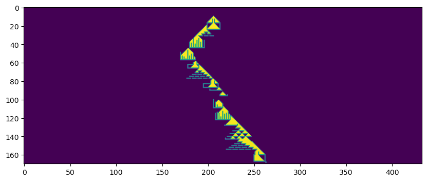
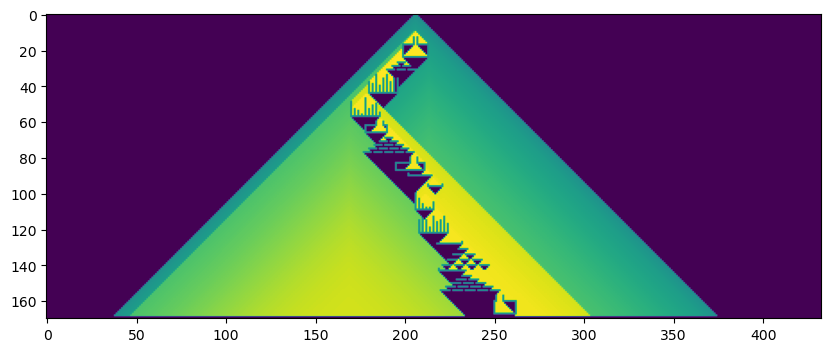

Day 17: The Tetris-like question

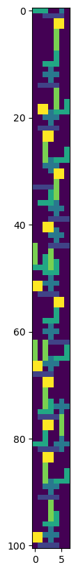

Day 22: Simulating Paths around a Cube

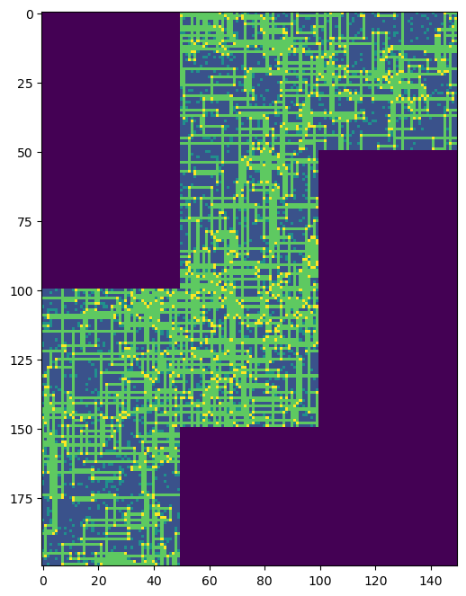

Day 23: The Diffusion question

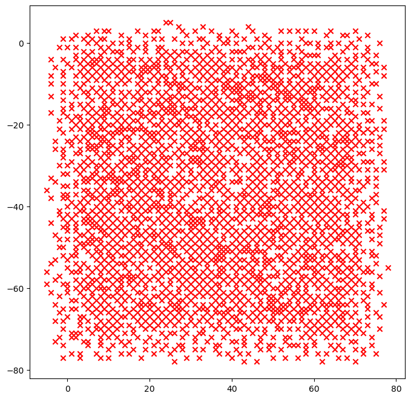
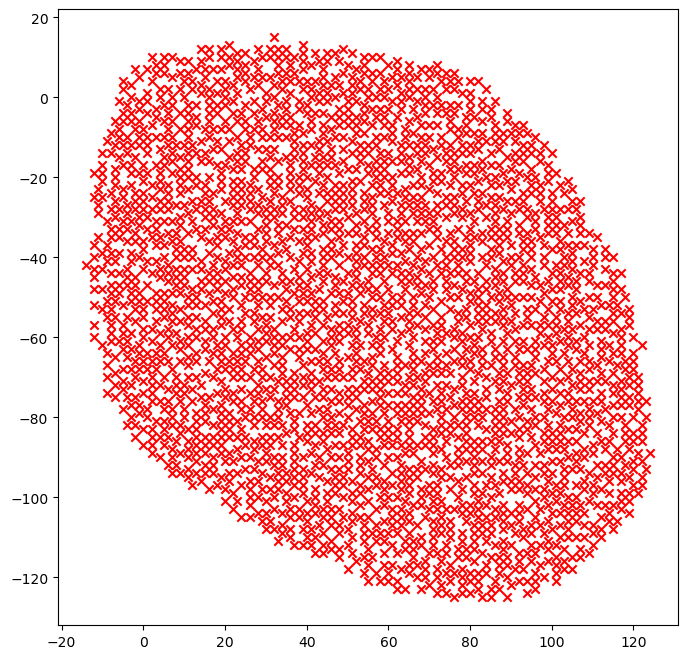

# Advent of Code 2021

Language: Python (Jupyter Notebook)

## Progress

| .      | [1](https://adventofcode.com/2021/day/1) | [2](https://adventofcode.com/2021/day/2) | [3](https://adventofcode.com/2021/day/3) | [4](https://adventofcode.com/2021/day/4) |
| ------ | ---------------------------------------- | ---------------------------------------- | ---------------------------------------- | ---------------------------------------- |
| Part 1 | ✔️                                       | ✔️                                       | ✔️                                       | ✔️                                       |
| Part 2 | ✔️                                       | ✔️                                       | ✔️                                       | ✔️                                       |
